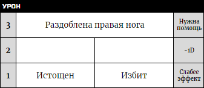

# Последствия

Действия противников, неудачные обстоятельства и другие затруднения из-за неудачных бросков могут иметь различные **последствия** для персонажей. Мастер выбирает **последствия** из списка ниже, следуя логике, повествованию и [позиции](position) броска.

## Сниженный эффект

_-1 уровень эффекта._    

Это последствие влечёт снижение эффективности действия - оно удалось хуже, чем планировалось. **Уровень эффекта** снижается на единицу. _Ты попал по нему, но только рассек кожу. Она приняла ваше поддельное приглашение, но будет присматривать за вами на приёме. Вы взбираетесь по стене, но это сложнее, чем казалось, и вы только на пол пути._   																				

## Ухудшение позиции

_-1 позиция. Можно попытаться снова, но уже из худшей позиции._

Это последствие значит потерю контроля над ситуацией и ты вынужден действовать из худшей, более опасной позиции. Например, ты прыгал с крышу на крышу **рискованным** броском, но немного не достал и теперь висишь, держась за сточную трубу. Ты не преуспел, но и не провалился. Ты можешь попытаться снова, но уже их **отчаянной** позиции. Это последствие хорошо подходит для повышения напряжения в ситуации и нагнетании атмосферы.

## Потерянная возможность

_Чтобы попытаться снова, нужно использовать другой подход._						

Это последствие показывает, что обстоятельства изменились. У тебя была возможность достигнуть цели этим действием, но она ускользнула. Чтобы попытаться снова, тебе нужно изменить подход, использовав другое действие и метод. Например, ты **Сражался** со знатным лордом с целью заставить его отступить на балкон и там отрезать путь к отступлению. Но ему удалось уклониться от твоего маневра и теперь он вне досягаемости. Теперь нужно найти другой способ - возможно попытаться **Повлиять** и уговорить, использовав свой бандитский шарм.														

## Затруднение

_Малое: Ожидаемая проблема, 1 тик часов или +1 накал._ 																				
_Обычное: Внезапная проблема, 2 тика часов или +1 накал._																				
_Серьезное: Серьезная проблема, 3 тика часов или +2 накала._

Это последствие отражает новую проблему или увеличивающуюся угрозу. Мастер может сразу ввести новую проблему, возникшую из-за неудачного действия: комната охвачена огнём, тебя обезоружили, банда получает +1 накал из-за оставленных улик или свидетелей, ухудшается отношение с организацией, цель избегает боя и теперь это погоня, прибывает подкрепление и т.п.

Или Мастер может отметить тик часов (и создать их при необходимости), отмечающих затруднение, вроде часов "тревоги наружной стражи"	или "подозрение знатных гостей". Заполните один тик для малого затруднения и два тика для обычного затруднения.

**Серьёзное затруднение** несёт большую угрозу: подкрепление окружает вас, комната не просто загорается, но обваливающийся потолок закрывает проход к двери, оружие ломается, цель теряется из виду, банда получает +2 накала и т.п. Заполните три тика часов затруднения.

**Не вводите затруднений, которые бы отменяли успешный бросок.** Например, если игрок прижал противника к стенке, бросив **4/5**, то затруднение не может быть "противник выскользнул и скрылся". Вместо этого можно сказать "во время борьбы, он схватил твоё оружие".

## Урон

Это **последствие** обозначает длительное повреждение, вред или слабость. Когда ты получаешь **урон**, то запиши его в лист персонажа в строку, соответствующую уровню урона: **незначительный урон** в нижнюю строку, **средний урон** в среднюю строку и **серьёзный урон** в верхнюю строку.

Твой персонаж получает штраф, который обозначен в соответствующей урону строке, если хотя бы в одной ячейке строки есть урон, который может повлиять на твоё действие. Например, если ты _"Истощён"_ (урон 1 уровня), то твои попытки убежать от погони будут иметь **пониженный уровень эффекта**. Урон 2 уровня отнимает **-1d** из броска. А урон 3 уровня **выбивает тебя из ситуации** (ты теряешь сознание, еле двигаешься, очень плохо мыслишь и т.п.) и не можешь совершать действия, пока тебе не окажут необходимую помощь или ты не приложишь **особое усилие** ([см. Стресс](../stress-trauma)).

Если тебе нужно заполнить ячейку, а свободных ячеек этого уровня уже нет, то урон **двигается на один уровень вверх**. Например, если ты получил средний урон 2 уровня, а обе ячейки 2 уровня уже заполнены, то урон получает 3 уровень. Если же тебе нужно получить урон 3 уровня, а он уже заполнен, то персонаж переносит **катастрофическое постоянное последствие** (потеря конечности, смерть, безумие и т.п. в зависимости от ситуации).

_Этот персонаж имеет три урона: "Раздробленную ногу" (3 уровень) плюс "Истощение" и "Избит" (1 уровень). Если он получит еще урон 1 уровня, то этот урон повысится на уровень вверх до 2. Если этот персонаж получит урон 3 уровня, то урон станет фатальным (4 уровень)._

### Примеры урона

**Фатальный (ур. 4):** утонул, проткнут в сердце, одержим духом

**Серьёзный (ур. 3):** сломана нога, проткнут живот, сильный ожог, в ужасе

**Средний (ур. 2):** вымотался, глубокий порез руки, в панике, соблазнён

**Незначительный (ур. 1):** побит, устал, отвлечён, напуган, сбит с толку
