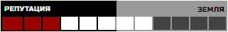

# Организации

_Дасквол — это город преступности, с самых низов и до верхушки власти. Недолговечные союзы, кровавая месть - в этом хаосе коррупции и насилия ваша банда будет пробивать себе путь. Будете ли вы сломлены или окажитесь на вершине криминального мира Дасквола?_

## Уровень организации

Посмотрите на лист **организаций**. Каждая значительная организация города имеет **уровень** — показатель её влияния, богатства и численности. На вершине стоят организации **V** и **VI** уровней — истинная власть Дасквола.

Ваша банда начинает с **уровня 0**. **Рейтинг уровня** используется для бросков при получении ресурсов, а также бросков фортуны, когда главной чертой является мощь или влияние вашей банды. Но самое важное — уровень банды также является **уровнем качества** ваших вещей (снаряжение, оружие, транспорт и т.п.), а также **качеством** и **размером** нанимаемых **шаек**.

### Влияние уровня на размер банды

- **Уровень V:** Огромная банда (80 человек)
- **Уровень IV:** Большая банда (40 человек)
- **Уровень III:** Крупная банда (20 человек)									
- **Уровень II:** Средняя банда (12 человек)								
- **Уровень I:** Мелкая банда (3-6 человек)						
- **Уровень 0:** 1 или 2 человека.			

# Положение

Следом за уровнем организации идёт её **положение** — то, как крепко организация держится на текущем месте в иерархии. **СИЛ** - означает **сильное положение**, **СЛАБ** - **слабое положение**.

Ваша банда начинает с **сильного положения на уровне 0.**

### Потеря положения

Вы можете провести операцию, которая специально направлена на подрыв **положения** другой организации, если вы знаете её слабость и уязвимость. Если операция успешна, то организация понижает **положение** с **СИЛ** на **СЛАБ**. Если положение уже **слабое**, то организация **теряет 1 уровень, а положение остается слабым.**

Во время **войны**, организации в ней замешанные **теряют положение** (это также может привести к _временному_ снижению **уровня**, пока не закончится война).

Ваша банда может потерять **положение** и **уровни** по тем же правилам. Если уровень вашей банды **0**, положение **слабое** и вы теряете **положение**, то вашу банду полглощают или стирают с улиц Дасквола.

# Продвижение

Чтобы двигаться вверх по иерархии и развивать банду нужна **репутация**. Репутация — это показатель авторитета, известности. Когда вы получаете достаточно **репутации**, то другие организации начинают воспринимать вас всерьез, вы обретаете необходимое уважение и поддержку для роста и развития банды.

Когда вы выполняете **дело**, ваша банда получает **2 репутации**. Если у **цели** вашего дела был **уровень выше**, то вы получаете **+1** дополнительную репутацию за каждую единицу разницы в уровне. Если **цель** была **ниже уровнем**, то отнимите **-1** за разницу в уровне из полученой за дело репутации (минимум 0).
Вам нужно **12 репутации**, чтобы заполнить шкалу репутации на листе банды. Когда шкала заполнена, сделайте одно из:
- Если ваше положение **слабое**, то оно становится **сильным**. Сбросьте шкалу репутации до нуля.
- Если ваше положение **сильное**, то вы можете заплатить **монеты**, чтобы **повысить уровень банды на 1**. Количество требуемых **монет** равняется вашему **следующему уровню x 8** (например, чтобы перейти с уровня **I** на **II** нужно **16** монет). Пока ваша шкала репутации заполнена - вы не получаете репутацию, пока не повысите уровень. **После повышения уровня сбросьте шкалу репутации до нуля и измените положение на слабое.**

# Земля

Другим способом развития банды является захват и приобретение **земли**, особых типов **областей**, представляющих районы или улицы города. По мере расширения территории, ваша банда становится более влиятельной и легче зарабатывает репутацию.

**Земля** отмечается на **шкале репутации** (см. пример ниже). Каждый кусок земли в вашем владении снижает требуемое для **продвижения** число **репутации**. Максимальное число **земли**, которое может быть под контролем банды - **6**. При сбросе шкалы репутации, земля остается в вашем владении.

_Банда владеет **4** участкам **земли**, а значит ей осталось только **5** репутации для **продвижения**. После продвижения, отмеченная земля остается на шкале, а репутация сбрасывается._		

# Отношение

**Отношение** вашей банды с каждой организацией отмечает как она относится к вам. Уровень **отношений** может варьироваться от **-3** до **+3**. **0** (нейтральное) является исходным отношением всех организаций. Отмечайте отношение на листе организаций.

При создании банды вы распределите положительные и отрицательные изменения **отношения** с организациями, чтобы отразить недавние события. В последствия рейтинг будет изменяться в зависимости от ваших действий и внешних факторов.

### Изменение отношений

Когда вы совершаете операцию, ты получаете **-1** или **-2** **отношение** с организацией, которой навредили своими действиями. Вы также получаете **+1 отношение** с организацией, которой помогли своим делом. Если ваша операция была полностью тайной и бесшумной, то **отношения** не изменяются. Отношение может также изменится, если вы выполняете поручение другой организации или отвергаете их требования.

## Уровни отношения

- **+3: Союзные.** Эта организация поможет вам, даже если это не в их интересах. Они ожидают от вас того же.
- **+2: Дружеские.** Эта организация поможет вам, если это не навредит ей. Они ожидают от вас того же.
- **+1: Помогающие.** Эта организация поможет вам, если это не создаст никаких проблем и не будет многого ей стоить. Они ожидают от вас того же.
- **0: Нейтральные.** Организация или не знает о вас или вы ей безразличны.
- **-1: Мешающие.** Эта организация может навредить вам или попытаться извлечь выгоду из ваших неприятностей, если ей не будет это многого стоить. Они ожидают от вас того же.
- **-2: Враждебные.** Эта организация навредит вам, если риск будет оправдан. Они ожидают от вас того же.
- **-3: Война.** Эта организация будет стараться навредить вам, даже если это не в их интересах. Они ожидают от вас того же.

Когда вы находитесь в состоянии **войны** с любым числом организаций (отношение **-3**), то налагаются следующие штрафы:
- Вы и ваш противник теряете **1 положение** (временно, пока длится война). Это может отбросить вас и его на **уровень** ниже.
- Игроки имеют только **одно занятие перерыва**.
- Каждое **дело** даёт дополнительно **+1 накал**.
- Ваши **области**, генерирующие **монеты** (обитель порока, бойцовские ямы, ломбарды и т.д.) производят только половину дохода (округляя вниз).

# Области

**Область** — это абстрактное определение, которое может значить как некоторую территорию, связи, область влияния. На каждом листе банды есть карта областей, которые может заполучить банда с логовом в центре.

Все **области** уже находятся под контролем других **организаций** и вам придется отбивать их силой или смекалкой. Скажите Мастеру какую область вы хотите получить и он расскажет какая организация владеет ей и что находится в этом месте.

## Получение области

Для получения **области**, вы проводите операцию по тем же правилам, что и обычное **дело**. В случае успеха, вы получаете область, а другая организация теряет её. Захват области является серьезным актом агрессии, поэтому **отношение** с организацией у которой был произведен захват, становится **-2**. Также это может увеличить отношение с её организацией-противником на **+1**. _Враг моего врага - мой друг._

!>  Область можно захватить только если она прилегает к другой области, которой вы владеете (в начале это логово).

Как только вы получаете **область**, все описанные на ней эффекты начинают действовать на вас. Некоторые области являются **землями** (см. выше), другие дают постоянные бонусы к тем или иным действиям.

## Потеря области

В некоторых случаях другие организации могут попытаться напасть и отобрать ваши **области**. В зависимости от ситуации, вы можете сражаться, договориться или сдать область. При потере **области** сразу же теряете все связанные с ней бонусы.
