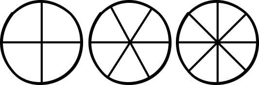

# Счётчики прогресса

**Счётчики прогресса** — это круг, разделённый на 4, 6 или 8 продвижений (делений). Нарисуйте счётчик, когда вам нужно отследить прогресс достижения цели, преодоления препятствия или отсчёта до надвигающейся проблемы. Чем сложнее проблема, тем больше продвижений имеет счётчик.

Каждый уровень эффекта отмечает определённое число продвижений счётчика прогресса ([см. Эффект](effect)). Задача Мастера — описать как прогресс на счётчике влияет на ситуацию и отмечать продвижения в зависимости от действий игроков.

Когда вы создаёте счётчик прогресса, назовите их именем **препятствия**, а не метода. Счётчики для проникновения должны называться _"Патруль по периметру"_ или _"Башня"_, а не _"Обойти патруль"_ или _"Взобраться на башню"_. Патруль и башня - это препятствия и игроки могут попытаться преодолеть их разными методами.

Сложные угрозы могут быть разбиты на несколько "слоёв", каждый из которых имеет свой счётчик прогресса. Например, логово доковой банды может иметь счётчик _"Охрана периметра", "Охрана внутри" и "Телохранители в офисе босса"_. Банде придётся пройти через все эти слои угрозы, чтобы добраться до сейфа в личном кабинете босса.

Простые препятствия не требуют создания счётчика, т.к. они как правило могут быть преодолены одним единственным действием.

## Примеры счётчиков прогресса

### Опасность
Показывает прогресс опасности, например повышение подозрения, возвращение владельца особняка, повышение уровня воды в затопленном гроте и т.п. Последствия неудачных бросков отмечают продвижения на этом счётчике.

### Гонка
Создайте два счётчика, отмечающих прогресс противоборствующих сторон. Например, игроки могут иметь счётчик "Побег", а синие мундиры - "Зажаты в угол". Чеё счётчик быстрее достигнет предела, тот достиг своей цели.
Также счётчики гонки могут быть использованы для состязание с окружением. Например, игроки обыскивают библиотеку во время пожара - создайте счётчик "Книга по оккультизму" и "Библиотека сгорела".

### Миссия
Этот счётчик используются для миссий с ограничением по времени. Когда счётчик заполнится, окно возможности будет потеряно - цель сбежит, портал в призрачный зал закроется, в генераторе закончится топливо и т.п.

### Долгосрочный проект
Большинство инженерных, алхимических и оккультных проектов требуют продолжительного времени. Такие счётчики имеют 8 продвижений, но особо сложные изобретения могут потребовать нескольких связанных счётчиков.

### Организация
У всех организаций есть цель, к которой они стремятся. Если действия игроков повлияли на организацию, прибавьте или убавьте продвижения с счётчика организации. Счётчик организаций может меняться независимо от игроков.

### Перетягивание каната
Этот счётчик обозначают длительное состояние, которое может изменяться в обе стороны. Например, счётчик "Революция" показывают настроения северосских беженцев. Действия властей могут прибавлять или убавлять продвижения.
